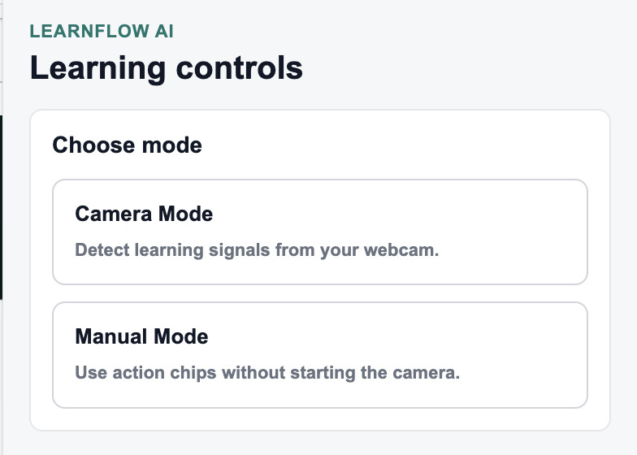
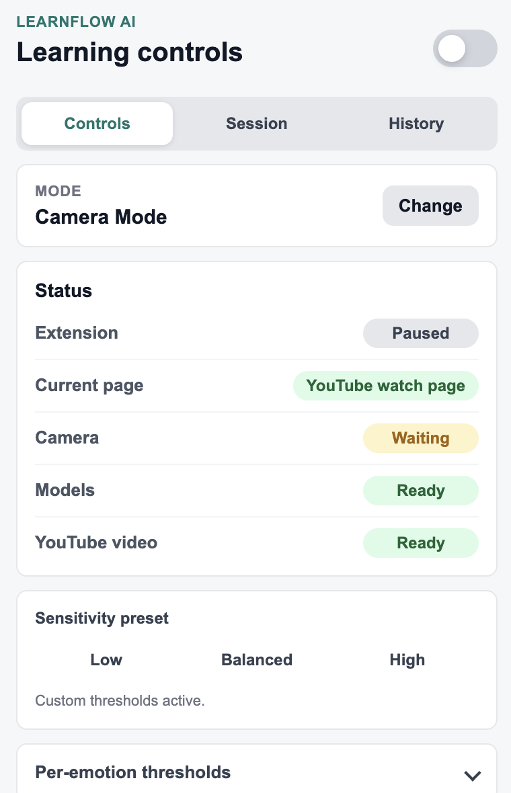
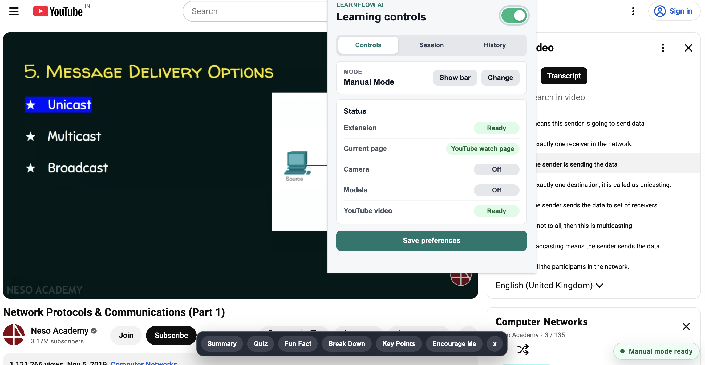
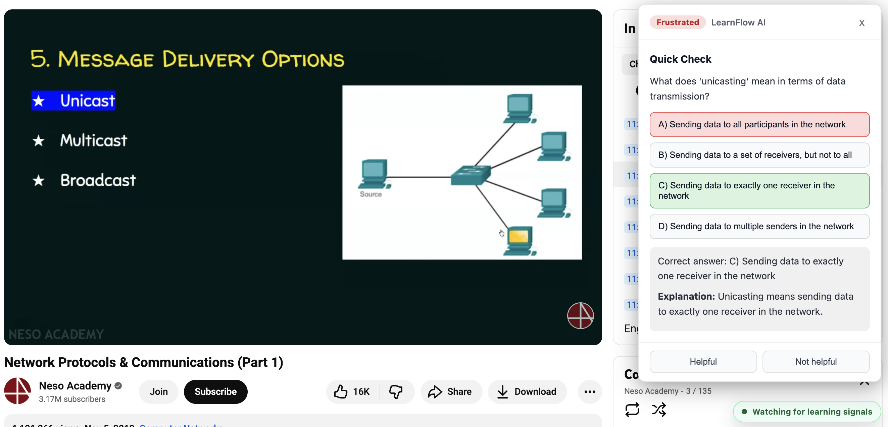
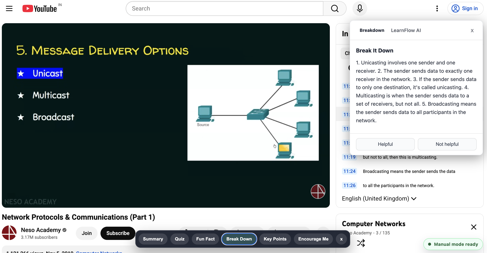
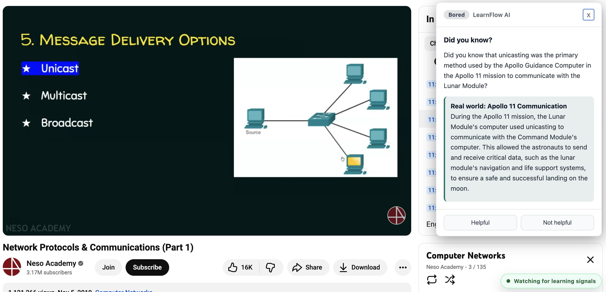
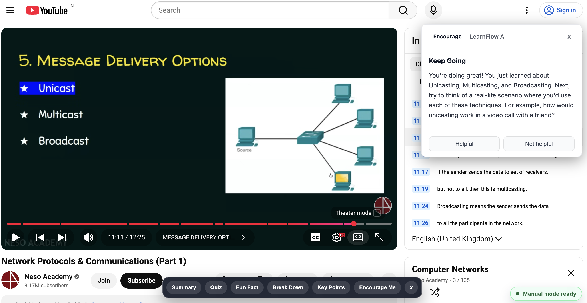

# LearnFlow AI

A Chrome extension that watches your face while you watch YouTube — detecting when you're confused, frustrated, or bored, and instantly serving up AI-powered help tailored to that exact moment in the video.

---

## Screenshots

**Choose your mode on first launch**


**Camera Mode — live status dashboard**


**Manual Mode — action bar chips on the video page**


**Frustration detected → instant micro-quiz**


**Confused → step-by-step breakdown of the current concept**


**Bored → surprising fun fact with a real-world example**


**Encouragement nudge with a practical next step**


---

## What it does

LearnFlow AI runs in the background as you watch educational YouTube videos. It uses your webcam to read facial expressions in real time and triggers contextual learning interventions when it detects a negative learning signal.

| Detected emotion | AI response |
|---|---|
| Confused | Plain-language summary of the current concept |
| Frustrated | Micro quiz to reinforce understanding |
| Bored | Surprising fun fact + real-world example |

You can also skip the camera entirely and use **Manual Mode**, where action chips let you request help on demand: Summary, Quiz, Fun Fact, Break Down, Key Points, or Encourage Me.

At the end of a session, LearnFlow generates a recap of what you covered and how engaged you were.

---

## Features

- **Real-time emotion detection** via [face-api.js](https://github.com/justadudewhohacks/face-api.js) (runs entirely in the browser — no video is sent anywhere)
- **Context-aware AI responses** anchored to the transcript at your current timestamp, not the video as a whole
- **Two modes**: Camera Mode (automatic) or Manual Mode (on-demand action chips)
- **Sensitivity tuning**: Low / Balanced / High presets, with per-emotion threshold sliders
- **Cooldown control**: Prevents alert fatigue (30 s → 5 min options)
- **Session analytics**: Heatmap of emotion triggers per session
- **Quiz score tracking**: Streak counter across a session
- **Response history**: Last 20 AI responses, downloadable as JSON
- **LLM provider toggle**: Groq cloud (default) or a local LLM via LM Studio

---

## Setup

### 1. Get a free Groq API key

Sign up at [console.groq.com](https://console.groq.com) and create an API key. It's free.

### 2. Load the extension in Chrome

1. Go to `chrome://extensions`
2. Enable **Developer mode** (top-right toggle)
3. Click **Load unpacked**
4. Select the `learnflow-ai` folder

### 3. Complete the in-extension setup

The first time you open the LearnFlow AI popup, it will walk you through:

1. **Welcome screen** — brief intro
2. **Groq API key** — paste your `gsk_...` key; it's stored locally in your browser and never sent anywhere except Groq's API
3. **Choose mode** — Camera Mode (automatic emotion detection) or Manual Mode (on-demand action chips)

That's it — no config files to edit.

### 4. Pro tip: open the transcript first

Before starting a session, click `...` below the YouTube video → **Show transcript**. LearnFlow reads the transcript panel to anchor its AI responses to the exact moment you're at. Without it, responses fall back to the video title and description only.

---

## Project structure

```
learnflow-ai/
├── background.js          # Service worker — LLM calls, settings, message routing
├── manifest.json          # Chrome extension manifest (MV3)
├── content/
│   ├── content.js         # YouTube page script — camera, emotion detection, overlays
│   └── content.css        # Overlay and chip styles
├── popup/
│   ├── popup.html         # Extension popup UI
│   ├── popup.js           # Popup logic
│   └── popup.css          # Popup styles
├── lib/
│   └── face-api.min.js    # Bundled face-api.js (browser, no external fetch)
├── models/
│   ├── tiny_face_detector_model-*        # Lightweight face detector
│   └── face_expression_model-*           # Expression classifier
└── icons/
    ├── icon16.png
    ├── icon48.png
    └── icon128.png
```

---

## Privacy

- Your camera feed is processed **entirely on-device** using face-api.js. No video frames leave your browser.
- Only the video title, a short transcript excerpt, and the detected emotion are sent to the LLM provider (Groq or local).
- No data is collected by this extension beyond what Chrome stores locally on your machine.

---

## License

MIT © [Saksham Virmani](https://github.com/sakshamvirmani)

This project is open source under the MIT License. You are free to use, modify, and distribute it, but **you must retain the original copyright notice and attribution** in all copies or substantial portions of the software.
